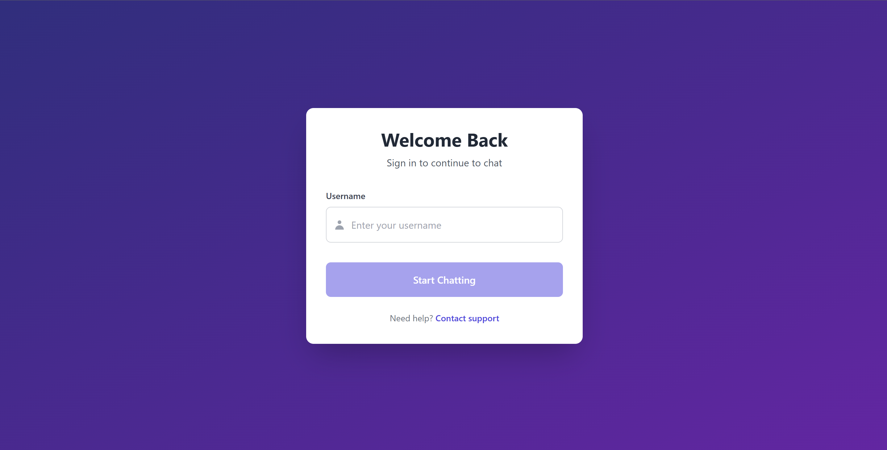
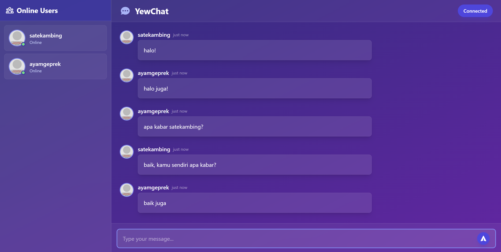

# Module 10
##### Deanita Sekar Kinasih
##### 2306229405

## 3.1 Original code of broadcast chat
Login

Chat

## 3.2 Experiment 3.2: Be Creative!
Enhance Login

Pada halaman login, saya meningkatkan tampilan dengan mengimplementasikan latar belakang bergradasi indigo-purple. Saya menambahkan animasi hover yang halus, sistem validasi username, ikon pengguna, serta pesan kesalahan yang informatif untuk meningkatkan interaksi pengguna. Tombol "Start Chatting" didesain ulang dengan tampilan yang lebih menarik dan responsif. Secara keseluruhan, tata letak halaman disusun dengan spacing yang proporsional dan hierarki visual yang lebih terstruktur, menciptakan pengalaman pengguna yang lebih profesional dan menyenangkan.

Enhance Chat

Pada halaman chat, saya mengimplementasikan desain dengan latar belakang bergradasi indigo-purple. Sidebar pengguna ditingkatkan dengan penambahan indikator status dan efek hover responsif yang meningkatkan pengalaman navigasi. Tampilan pesan ditingkatkan dengan gelembung chat yang elegan dan animasi halus saat interaksi. Selain itu, header aplikasi telah ditingkatkan untuk menampilkan status koneksi dengan jelas, sementara area input pesan disempurnakan dengan efek fokus responsif yang memudahkan pengguna saat mengetik pesan.